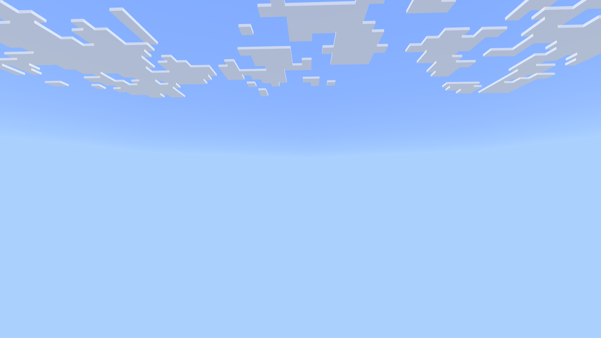

# Void World

Void World is a Minecraft Bedrock behavior pack that generates a void world in the overworld, nether and end. This is great for map builders who want a blank state.

## Using the pack

### Building from source
* Clone this repository.
* Open the cloned repository in File Explorer.
* Zip the all the contents in the ```void``` directory into a file ```void.mcpack```. The file extension ```.mcpack``` is important for Minecraft to know what to do with the files.
* Double click the zipped file and it will automatically be loaded into Minecraft.

### Download from release
* On the ```Releases``` tab you can download the latest .mcpack file.
* One the .mcpack file is downloaded, double click it and it will automatically be loaded into Minecraft and then you can use it in your worlds.

## Photos of using this pack

### Overworld


### Nether


### End
